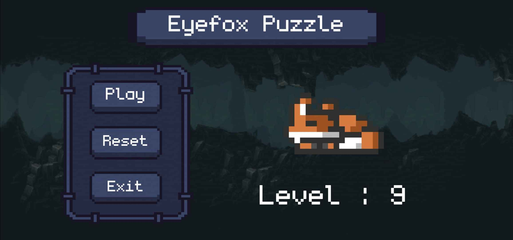
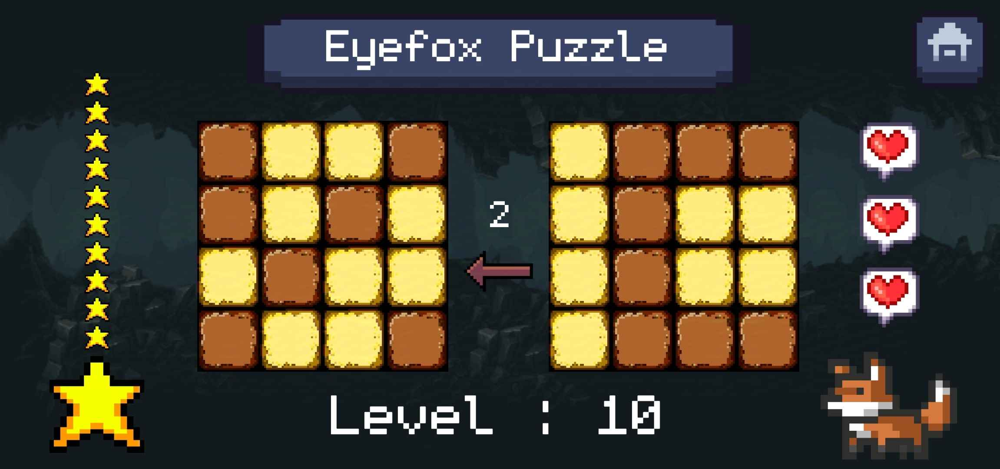

# Eyefox Puzzle

This project is a puzzle game developed in Java for Android. It is an educational application I created to deepen my knowledge of Android development. The game is simple yet engaging and will be published on the Google Play Store.

---

## 🎮 Gameplay  

- **Rule**: You will have two grids made up of light and dark tiles. Your goal is to make the two grids identical by swapping the color of a tile, which will also flip the colors of all its neighboring tiles.

---

## 🚀 Technologies Used  

- **Programming Language**: Java  
- **Platform**: Android  
- **Tools**: Android Studio  

---

## 📖 Project Purpose  

As a student, this project helps me to:  
1. Explore the fundamentals and best practices of Android development.  
2. Learn how to build and publish an app on the Google Play Store.  

---

## 📁 Asset Sources  

The assets used in this game were sourced from [itch.io](https://itch.io), a well-known platform for creative and free resources.  
Here are links to some specific resources:  
- [Font](https://datagoblin.itch.io/monogram)  
- [Background](https://szadiart.itch.io/pixel-fantasy-caves) 
- [GUI Elements](https://mounirtohami.itch.io/pixel-art-gui-elements)
- [Fox](https://elthen.itch.io/2d-pixel-art-fox-sprites)

*Note*: While I do not have links to all the assets used, every asset was verified as royalty-free according to its terms on itch.io.

---

## 🔒 Privacy Policy  

A dedicated privacy policy page is available here:  
[Privacy Policy](https://westerbay.github.io/Eyefox-Puzzle/)

---

## 🛠️ Deployment  

Available on the [**Google Play Store**](https://play.google.com/store/apps/details?id=games.wester.eyefoxpuzzle).  

---

## Author  

Wester

