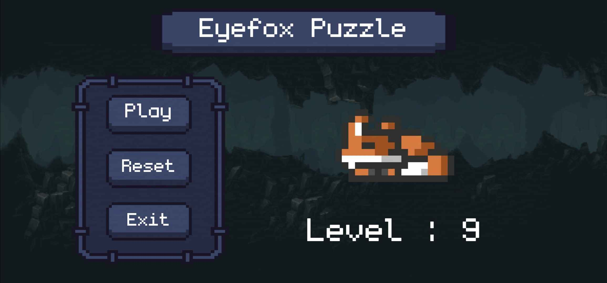
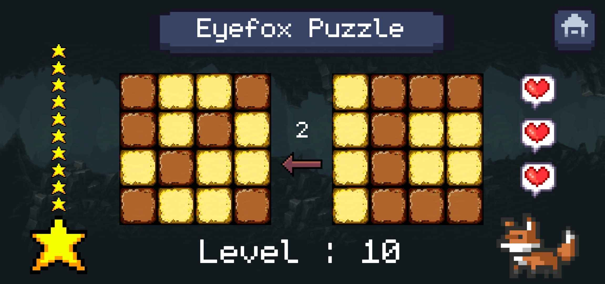

# Eyefox Puzzle

Eyefox Puzzle is an Android puzzle game I developed on my own in Java during my studies at ENSICAEN. It was inspired by a game on the Nintendo DS.

**The game was previously published on Google Play but is no longer available on app stores.** The source code and screenshots remain available in this repository.

## Gameplay

Each level has two grids of light and dark tiles. The goal is to make the grids identical. Changing a tile's color also flips the colors of its neighboring tiles.

## Technologies

- Java
- Android
- Android Studio

## Project context

This was an academic project. I built the Android game myself to learn Android development and take an app through release on Google Play.

## Asset credits

The game uses assets from [itch.io](https://itch.io), including:

- [Font](https://datagoblin.itch.io/monogram)
- [Background](https://szadiart.itch.io/pixel-fantasy-caves)
- [GUI elements](https://mounirtohami.itch.io/pixel-art-gui-elements)
- [Fox](https://elthen.itch.io/2d-pixel-art-fox-sprites)

*Note*: While I do not have links to all the assets used, every asset was verified as royalty-free according to its terms on itch.io.

## Privacy policy

The [privacy policy](https://westerbay.github.io/Eyefox-Puzzle/) remains available for the previously released Android game.

## Author

[Mathis Dubuisson](https://github.com/Westerbay)
